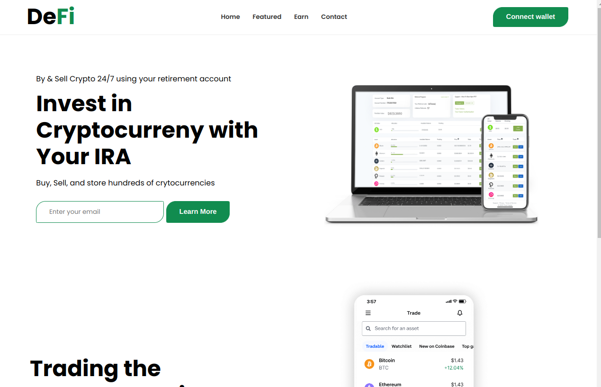

# DEFI app 

## dependency
* [ReactJS](http://www.reactjs.org)
* react-icons  `npm install react-icons`
* [api congecko market](https://api.coingecko.com/api)

## Clone the repositories

`git clone <http repositories>
`

In the project directory, you can run:

### `npm start`

Runs the app in the development mode.\
Open [http://localhost:3000](http://localhost:3000) to view it in your browser.

